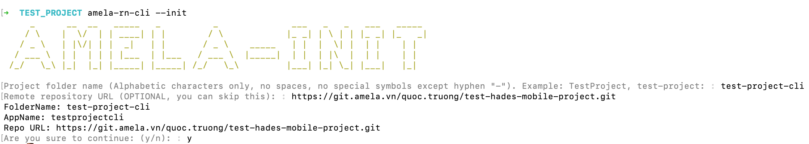
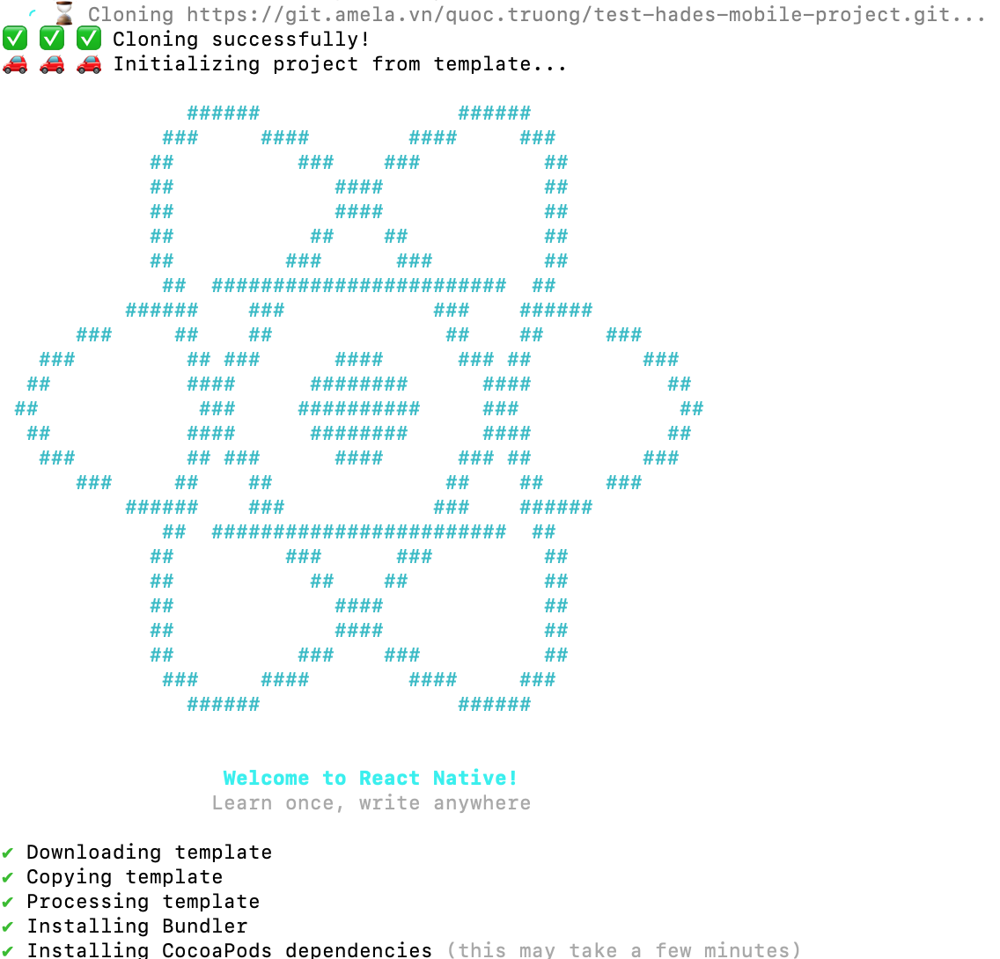
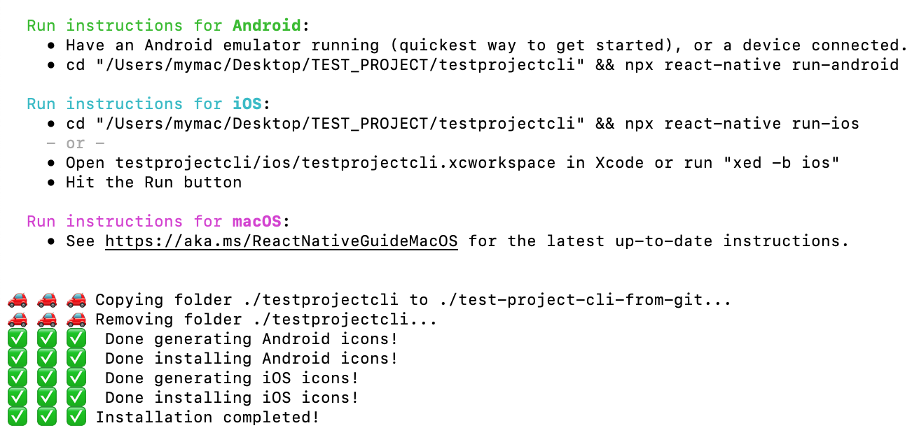

# Amela's react-native CLI (amela-rn-cli)
  

# Table of Contents

-   A. Purposes
-   B. Notes
-   C. Getting started
-   D. Features
    -   1. Create a new project
    -   2. Change app icon
    -   3. Change splash screen (BETA)
    -   4. Setup Fastlane (BETA)
    -   5. Setup Codepush (BETA)
-   E. Road-map

# A. Purposes
* Automatically creating react-native project from template [AMELA React Native Template](https://github.com/amela-technology/react-native-templet-v1).
* Automatically dividing project into 3 environments: **dev**, **staging** and **production**.
* Automatically changing app's icon.
* Automatically changing app's splash screen (BETA mode).
* Automatically setting up Fastlane (BETA mode).
* Automatically setting up Codepush (BETA mode).

---

# B. Notes
* Work best on macOS and Hackintosh.
* ❗ Windows not available yet!

---

# C. Getting started
## 1. Installation
`$ npm install -g -f amela-rn-cli`
## 2. Check version
`amela-rn-cli --version`

---

# D. Features
## 1. Create a new project

* Get inside folder that you want to create project.

* Run command line `$ amela-rn-cli --init`.

* Type in ProjectName.

* Type in repository's remote URL (if you have one)

* Waiting...

* Try running on both Android + iOS and enjoy!

## 2. Change app's icon
#### 2.1. NOTE
- **By default, project created by Amela-rn-cli will have "AMELA" icon.**
- **Must be inside a react-native project.**
- **Must have an image of app icon inside that project.**

#### 2.2. EXECUTE
* Get inside folder of project you want to change icon.

* Add an image to this folder (jpeg, jpg, png). For example, I added **defaultIcon.jpeg**.

* Run command line `$ amela-rn-cli --icon`.

* Type in the name of the image file for icon. For example, I typed **defaultIcon.jpeg**.

* Waiting and enjoy!

## 3. Change app's splash screen (BETA)
## 4. Setup Fastlane (BETA)
## 5. Setup Codepush (BETA)

---
# E. Road-map
- [x]   Integrate **GIT** in **Create New Project** feature.
- [ ]   Integrate **GIT** as an independent feature.
- [ ]   Find a way to process full-size images in **Splash Screen**.
- [ ]   Find a way to improve UI/UX of applying **Setup Fastlane**, **Setup Codepush**, **Setup OneSignal** (using .txt or .json to import params)
- [ ]   Integrate **Setup Firebase** in **Create New Project** feature.
- [ ]   Integrate **Setup Firebase** as an independent feature.
- [ ]   Auto create new project on Jenkins using scripts (**For Amela**)
- [ ]   Auto setup webhooks on Gitlab projects (**For Amela**)
- [ ]   Split roles: **Outer users** and **Amela-ers**.

