# Amela's react-native CLI (amela-rn-cli)
  

# Table of Contents

-   A. Purposes
-   B. Notes
-   C. Getting started
-   D. Features
    -   1. Create a new project
    -   2. Change app icon
    -   3. Change splash screen (BETA)
    -   4. Setup Fastlane

# A. Purposes
* Automatically creating react-native project from template [AMELA React Native Template](https://github.com/amela-technology/react-native-templet-v1).
* Automatically dividing project into 3 environments: **dev**, **staging** and **production**.
* Automatically changing app's icon.
* Automatically changing app's splash screen (BETA mode).
* Automatically setting up Fastlane.

# B. Notes
* Work best on macOS and Hackintosh.
* Windows can be buggy sometimes (not recommended for Windows).
# C. Getting started
## 1. Installation
`$ npm install -g -f amela-rn-cli`
## 2. Check version
`amela-rn-cli --version`

# D. Features
## 1. Create a new project
* Get inside folder that you want to create project.

* Run command line `$ amela-rn-cli --init`.

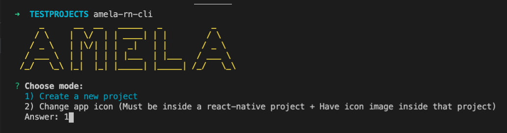

* Type in ProjectName.

* Type in ProjectDisplayName.

* Type in ProjectAppCode.

* Type in repository's remote URL (if you have one)

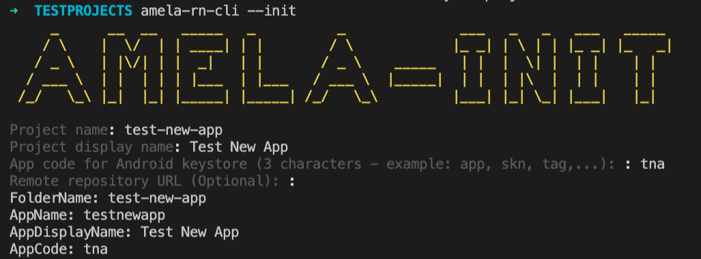

* Waiting...

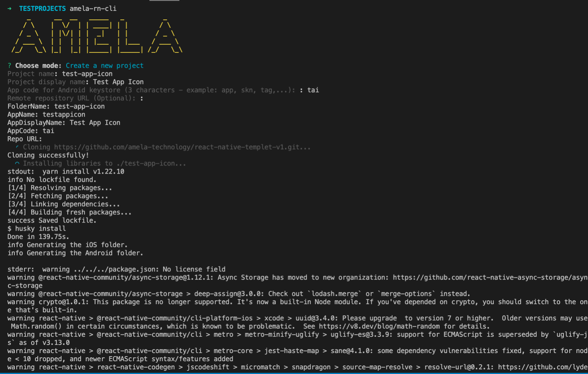

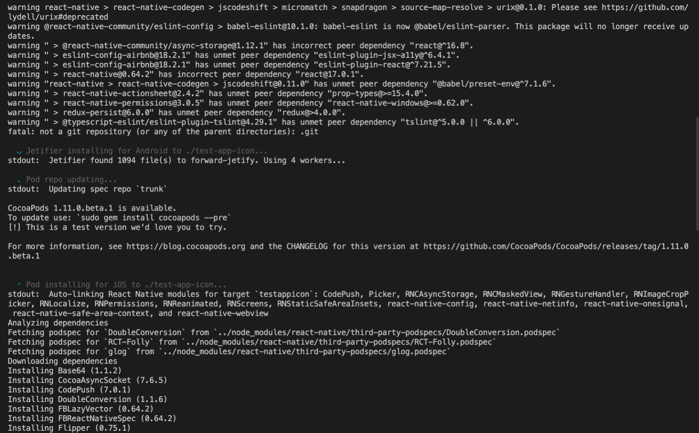

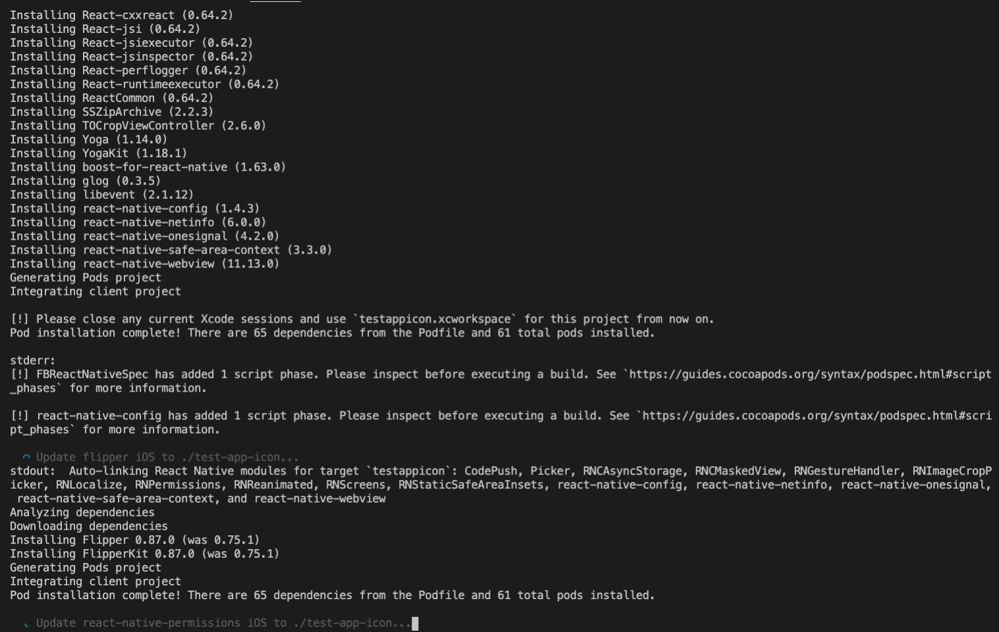

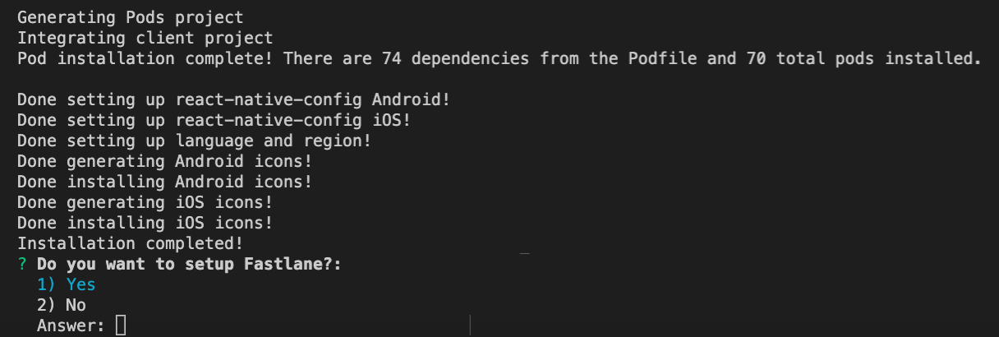

* Try running on both Android + iOS and enjoy!

---
## 2. Change app's icon

#### 2.1. NOTE
- **By default, project created by Amela-rn-cli will have "AMELA" icon.**
- **Must be inside a react-native project.**
- **Must have an image of app icon inside that project.**

#### 2.2. EXECUTE

* Get inside folder of project you want to change icon.

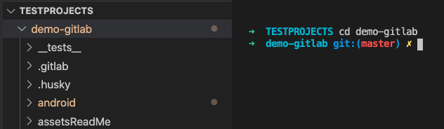

* Add an image to this folder (jpeg, jpg, png). For example, I added **defaultIcon.jpeg**.

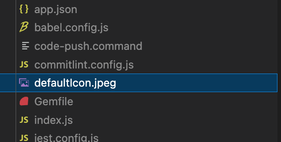

* Run command line `$ amela-rn-cli --icon`.

* Type in the name of the image file for icon. For example, I typed **defaultIcon.jpeg**.

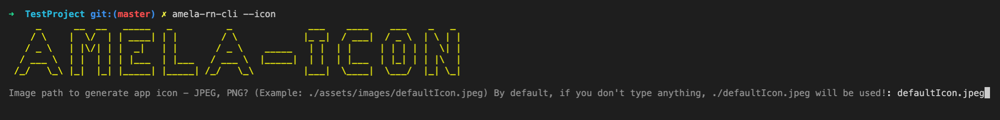

* Waiting and enjoy!

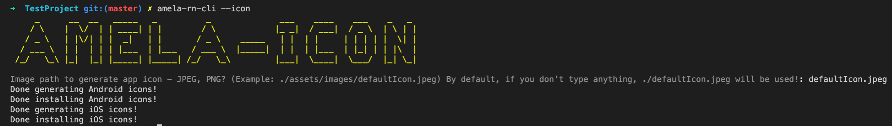

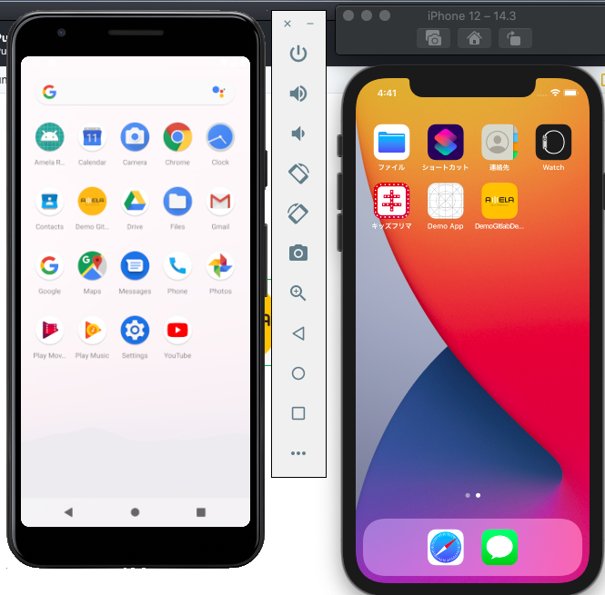

---
## 3. Change app's splash screen (BETA)
#### 3.1. NOTE
- **This feature is still in BETA mode.**
- **ONLY works for splash screens which have an icon at center, background has color only. NO BACKGROUND IMAGE!**
- **Must be inside a react-native project.**
- **Must have an image for the center icon of splash screen inside that project.**

#### 3.2. EXECUTE
* Run command line `$ amela-rn-cli --splash`.
* Type in icon path (icon at center of Splash screen).
* Type in Background color for Splash screen. **WHITE - by default**.
* Type in logo icon's width. **100 - by default**.

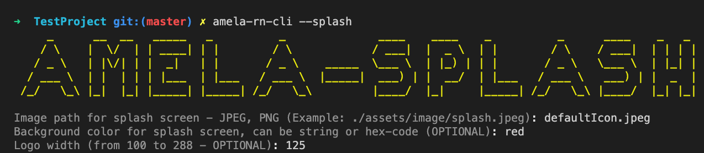

* Wait and enjoy.

---
## 4. Setup Fastlane
#### 4.1. NOTE
- **ONLY use this feature if you know how to use fastlane.**
- **This feature will connect to Microsoft Teams's channels through WEBHOOK. So make sure you have everything in Microsoft Teams setup!**
- **Must be inside a react-native project.**

#### 4.2. EXECUTE (2 ways)
#### A. Choose "Yes" after running `amela-rn-cli --init`

#### B. Using feature from Amela-rn-cli
* Run command line `$ amela-rn-cli --fastlane`. 
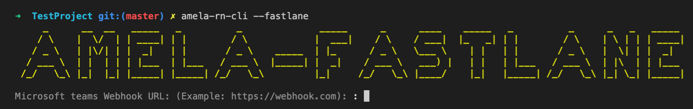

* Type in Microsoft teams Webhook.

* Type in folder to save Apple Provisioning Profile + Apple Certificate. **Note that this folder will be placed in folder /Downloads on MacOS.** 

* Type in iOS bundle ID for DEVELOPMENT environment.

* Type in iOS bundle ID for STAGING environment.

* Type in folder path to install fastlane files. **Note that you should install fastlane in your project's root folder.**
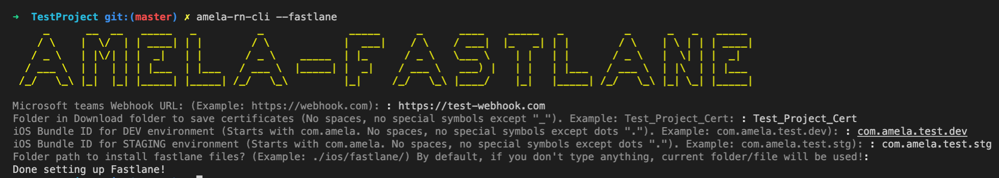

* Enjoy!
