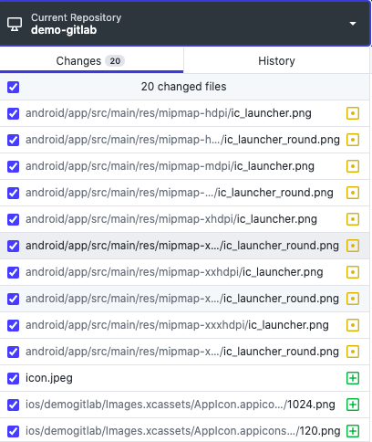

# amela-rn-cli
  

Amela's react-native CLI.
# A. Purposes
* Automatically creating react-native project from template [AMELA React Native Template](https://github.com/amela-technology/react-native-templet-v1)
* Automatically dividing project into 3 environments: **dev**, **staging** and **product**
* Automatically changing app's icon without going through many steps!

# B. Notes
* Work better on macOS and Hackintosh, Windows can be buggy sometimes.
# Getting started
`$ npm install -g amela-rn-cli`

# C. Features
## 1. Create a new project
* Get inside folder that you want to create project.

* Run command line `$ amela-rn-cli`.

* Choose mode 1 - **Create a new project**.

* Type in ProjectName, should be lowercase, don't have special characters except hyphen "-".

* Type in ProjectDisplayName.

* Type in ProjectAppCode, should be lowercase, maximum 3 characters.

* Type in repository's remote URL (if you have one)

* Waiting...

* Try running on both Android + iOS and enjoy!

* **Note: Project will have default AMELA icon**.
---
## 2. Change app's icon
* Get inside folder of project you want to change icon.

* Add an image to this folder (jpeg, jpg, png). For example, I added **icon.jpeg**.

* Run command line `$ amela-rn-cli`.

* Choose mode 2 - **Change app icon (Must be inside a react-native project + Have icon image inside that project)**.

* Type in the name of the image file for icon. For example, I typed **icon.jpeg**.

* Type in the name of folder inside **ios** folder. For example, I found that folder's name is "demogitlab", so I typed **demogitlab**.

* Waiting and enjoy!

